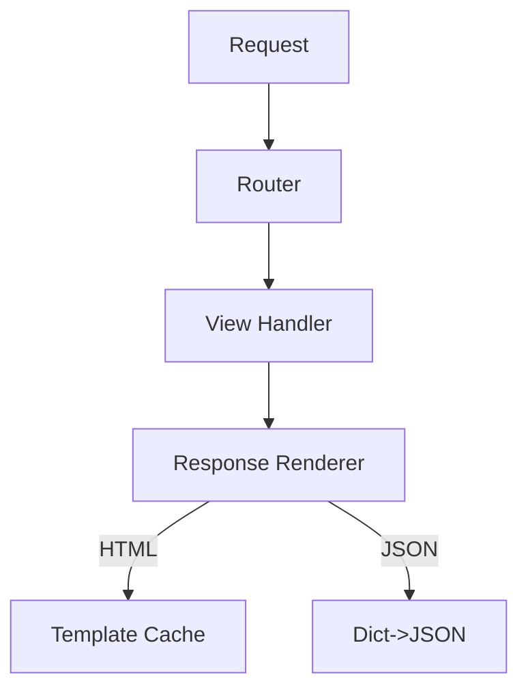

# Flash Web Framework

[](https://opensource.org/licenses/MIT)  
*A minimalist Python web framework for educational purposes and lightweight applications*

---
## Overview

Flash is a single-threaded web framework designed to:

- Demonstrate web framework fundamentals
- Provide a dependency-free solution for simple applications
- Serve as an educational tool for students learning web development

**Note**: This is not production-grade software and lacks advanced security features.

---

## Features

✔ **Core Functionality**

- Routing with decorators
- HTML & JSON responses
- Basic content type handling

✔ **Educational Value**

- Clean, readable implementation
- Minimal magic/abstraction
- Perfect for framework internals study

---

## Getting Started

### For Education

```bash
git clone https://github.com/your-repo/Flash-Web-Framework.git
cd Flash-Web-Framework
```

### For Lightweight Usage

```bash
git clone https://github.com/your-repo/Flash-Web-Framework.git --depth=1
cd Flash-Web-Framework
rm -rf .github .git .playground .excluded  # Remove development artifacts
```

---

## Example Implementation

_Dont forget to check the `.playground` folder_ 

```python
from flash import Flash, HttpMethod, ContentType
from flash.renderers import render_html, render_json
import random

app = Flash()


@app.route("/", ContentType.HTML, HttpMethod.GET)
def home():
    return """
    <h1>Welcome to Flash</h1>
    <p>Visit <a href="/info">/info</a> for endpoints</p>
    """


@app.route("/data", ContentType.JSON, HttpMethod.GET)
def random_data():
    return {"value": random.randint(1, 100)}


@app.route("/template", ContentType.HTML, HttpMethod.GET)
def show_template():
    return render_html("welcome.html")


if __name__ == "__main__":
    app.run(host="0.0.0.0", port=8080)
```

---

## Architecture Highlights



---

## Learning Path for students

### Skill-Building Exercises

| Difficulty       | Task                                   | Key Concepts             |
|------------------|----------------------------------------|--------------------------|
| **Beginner**     | Add `.env` support via `python-dotenv` | Configuration management |
| **Intermediate** | Replace `lru_cache` with Nginx caching | Reverse proxies, Docker  |
| **Intermediate** | Implement Jinja templating             | Template engines         |
| **Advanced**     | Integrate Hashicorp Vault              | Secrets management       |
| **Advanced**     | Add async support with `asyncio`       | Concurrency models       |
| **Expert**       | Implement middleware system            | Request lifecycle        |
| **Research**     | GIL-removed Python build               | Python internals         |


---

## Contribution Guidelines

We welcome educational contributions:

1. Fork the repository
2. Create a branch (`git checkout -b feature/your-feature`)
3. Commit changes (`git commit -am 'Add some feature'`)
4. Push to branch (`git push origin feature/your-feature`)
5. Open a Pull Request

---

## License

MIT License © 2023 [Armen-Jean Andreasian](https://github.com/your-profile)  
[](LICENSE)
